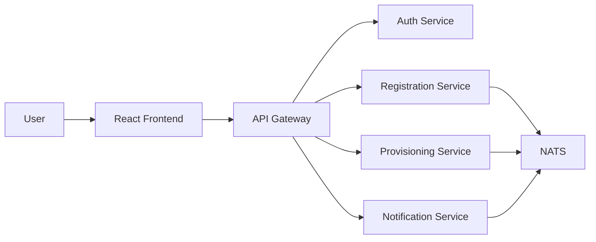
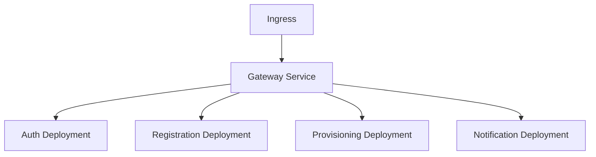

# Refactor Microservice — Deployment

Bagian ini fokus pada blueprint deployment menggunakan Docker Compose untuk development dan Kubernetes untuk production.

## Deployment awal dengan Docker Compose

Diagram konseptual:

Komponen yang disarankan:

- frontend: React/Vite container
- gateway: reverse proxy atau Go service
- auth-service, registration-service, provisioning-service, notification-service: container terpisah
- NATS: event bus
- PostgreSQL dan Redis: masing-masing bisa dipakai per service atau terpisah dengan schema berbeda

## Deployment matang dengan Kubernetes

Komponen utama:

- Ingress / Load Balancer
- Deployment per service
- Service per deployment
- ConfigMap / Secret
- StatefulSet untuk PostgreSQL dan Redis bila perlu
- HPA untuk scaling otomatis

Diagram konseptual:

## Prinsip operasional

Setiap service sebaiknya punya:

- Dockerfile sendiri
- health endpoint
- structured logging
- metrics endpoint
- retry policy untuk consumer event
- autoscaling dasar
